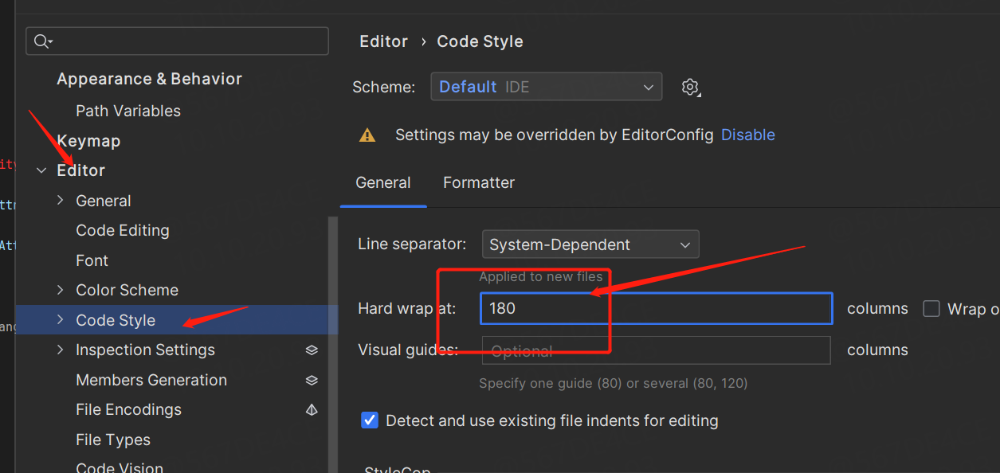
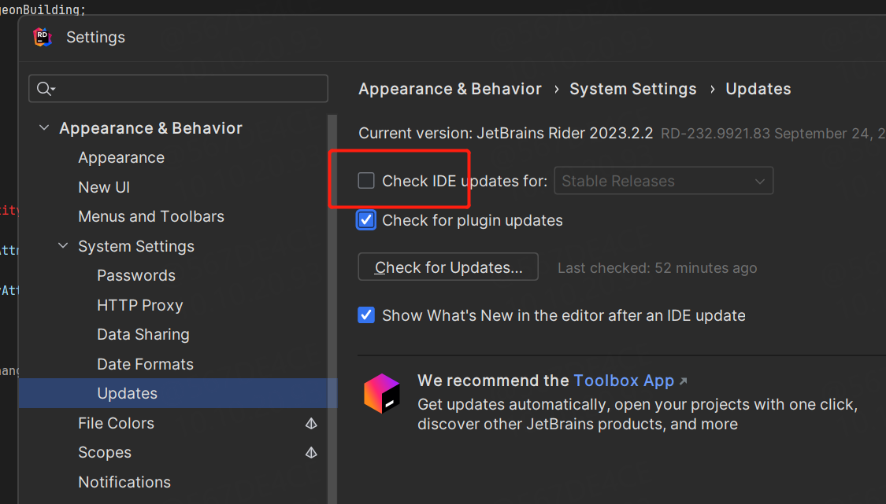

作为JetBrains系列深度依赖用户者,备注一下使用


## 设置

### 缓存设置
安装得.exe 一般有个 .properties  尾缀，修改配置自己设置的缓存路径

```
# Uncomment this option if you want to customize a path to the settings directory.
#---------------------------------------------------------------------
idea.config.path=D:\Caches\JetBrains/.IdeaIC/config

#---------------------------------------------------------------------
# Uncomment this option if you want to customize a path to the caches directory.
#---------------------------------------------------------------------
idea.system.path=D:\Caches\JetBrains/.IdeaIC/system

```


### 换行设置


默认宽度 12  可设置




### 关闭自动更新

